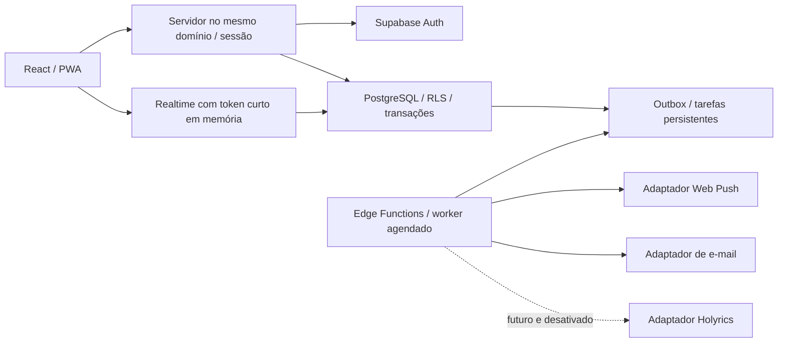

# Arquitetura recomendada

## Componentes

Monólito modular: uma interface e um backend com módulos por domínio, evitando serviços independentes prematuros.



| Camada | Escolha proposta | Justificativa |
| --- | --- | --- |
| Interface | React + TypeScript + Vite | Base tipada, modular e adequada ao protótipo e PWA |
| Rotas | React Router | Áreas por perfil e URLs previsíveis |
| Estilo | Tailwind CSS + componentes acessíveis | Identidade substituível por tokens, sem dependência visual da marca atual |
| Formulários | React Hook Form + Zod | Validação de interface e esquemas compartilháveis; backend sempre revalida |
| Estado remoto | TanStack Query | Carregamento, invalidação e reconciliação; sem persistência em disco |
| Backend | Supabase Auth, PostgreSQL, RLS, Realtime, Edge Functions | Centraliza identidade, dados e atualização com autorização |
| Arquivos | Supabase Storage privado | Adotar somente quando uma necessidade concreta surgir |
| Push | Web Push com VAPID | Evita dependência adicional de Firebase na primeira versão |
| E-mail | Resend atrás de contrato | Troca de provedor sem alterar o domínio de chamados |
| PWA | Vite PWA Plugin | Manifesto e service worker com política explícita de cache |
| Hospedagem | Vercel | Frontend e endpoints de sessão no mesmo domínio; custos/limites a validar antes de contratar |
| Qualidade | Vitest, Testing Library, Playwright, testes SQL/RLS | Regras, componentes, jornadas e isolamento |

Não se fixam versões de pacotes nesta fase. A Fase 2 consultará as fontes oficiais, verificará compatibilidade e gerará lockfile. Nenhum serviço pago será contratado automaticamente.

## ADR-001 — Sessão e camada de servidor

Decisão proposta: manter access/refresh tokens persistentes fora de Local Storage e IndexedDB. Uma camada de servidor (BFF) no mesmo domínio mediará login, renovação, logout e chamadas autenticadas. Cookie `HttpOnly`, `Secure`, `SameSite=Lax`, escopo restrito e preferência por prefixo `__Host-` conterá identificador opaco de sessão. Tokens do Supabase ficarão em armazenamento de sessão exclusivo do servidor, protegidos em repouso e indisponíveis aos papéis do aplicativo.

O BFF usará o JWT do usuário ao consultar o banco para preservar RLS. A chave administrativa não será usada para contornar as políticas de todas as requisições. Operações de provisionamento e workers terão privilégios separados e mínimos.

Mutações exigirão validação de origem e proteção CSRF. Sessões terão expiração, renovação e revogação; operações sensíveis verificarão sessão ativa e vínculos atuais, sem confiar somente em claims antigas. Troca de senha e desativação deverão revogar sessões conforme a política a definir.

Para Realtime, o BFF poderá fornecer um access token de curta duração em memória, com RLS e grants mínimos. Refresh token nunca vai ao JavaScript. Logout limpa memória e encerra assinaturas. Consultas após reconexão recuperam o estado oficial. Validar esse desenho em teste técnico na Fase 3 antes de considerá-lo pronto.

Tradeoff: aumenta a implementação de sessão e exige backend na hospedagem. Evita a persistência padrão de sessão no armazenamento JavaScript do navegador. Referências: [sessões do Supabase](https://supabase.com/docs/guides/auth/sessions) e [guia avançado de autenticação](https://supabase.com/docs/guides/auth/server-side/advanced-guide).

## ADR-002 — Transações e fronteiras

Check-in, recebimento, chamado, confirmação e check-out serão funções de domínio no banco ou operações equivalentes atomicamente transacionais. Cada função verifica ator, unidade, vínculos e transição esperada. Preferir invocação com identidade do usuário. Se `SECURITY DEFINER` for indispensável, usar `search_path` fixo, grants restritos, referências qualificadas e autorização explícita.

Não fazer múltiplas requisições independentes para gravar check-out, consumir código e auditar: esse conjunto deve confirmar ou falhar inteiro. Chaves de idempotência serão escopadas por ator/unidade/operação, vinculadas ao hash do pedido, com resposta reaproveitada; reutilização com conteúdo diferente será rejeitada.

Chamado e evento de outbox são gravados juntos. Workers tratam os canais depois do commit. Timeout externo não bloqueia a operação principal. Não há promessa de entrega externa exatamente uma vez.

## ADR-003 — Organização prevista

```text
src/
  app/                 # rotas, providers e composição
  components/          # componentes acessíveis compartilhados
  features/
    auth/ families/ events/ attendance/ calls/
    incidents/ notifications/ administration/
  lib/                 # cliente HTTP, erros e utilitários
  styles/              # tokens da identidade visual
  mocks/               # cenários fictícios do protótipo
server/                # sessão e endpoints no mesmo domínio
shared/                # contratos e validações não secretas
supabase/
  migrations/          # somente a partir da Fase 3
  functions/           # workers e adaptadores
  tests/               # permissões e invariantes
tests/e2e/
public/                # apenas recursos públicos seguros
docs/
```

Essa árvore é um plano; não foram criados módulos vazios ou código nesta fase. Holyrics terá contrato e configuração desativada durante a implementação das bases, sem cliente de rede ativo.

## ADR-004 — Ambientes e segredos

Desenvolvimento local, homologação e produção isolados. Fase 2 usa mocks, sem Supabase remoto, Resend ou push real. Fase 3 inicia com banco local quando viável; provisionamento remoto e chamadas a serviços reais exigem autorização.

Variáveis `VITE_*` são públicas. Somente valores não secretos poderão usá-las. O futuro `.env.example` terá nomes e placeholders, nunca credenciais. VAPID privada, credencial Resend, segredo de sessão, chave administrativa e futuros tokens Holyrics ficam somente no backend. Configurações administrativas não devolvem esses valores à interface.

CI futura: instalar por lockfile, verificar tipos/lint/testes, executar build, testar migrations em banco descartável e validar RLS. Deploy e migrations de produção são passos separados, sujeitos à autorização prevista.

## Erros e observabilidade

Respostas terão código estável, mensagem segura e identificador de correlação. Exemplos: `EVENT_CLOSED`, `CLASS_FULL`, `ATTENDANCE_EXISTS`, `PICKUP_INVALID`, `SESSION_EXPIRED`, `RATE_LIMITED`. Evitar mensagens que revelem dados de outra família.

Logs técnicos usam IDs opacos, operação, duração e resultado; não payloads integrais. Auditoria é separada de logs técnicos. Saúde dos workers, atraso da fila e taxa de falha dos canais serão monitorados. Configurações de métricas externas ficam pendentes de necessidade e autorização.
