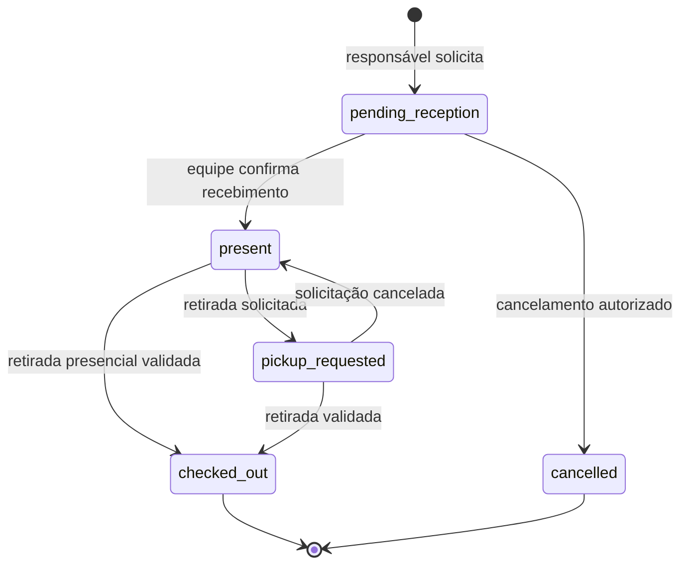
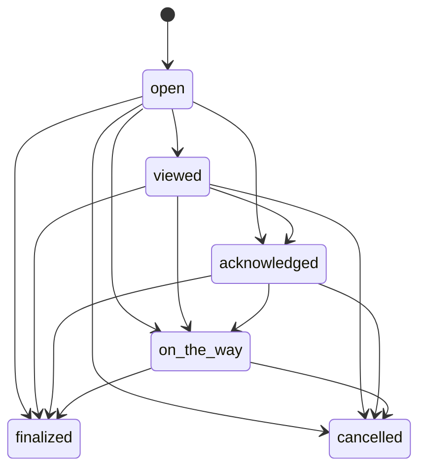

# Fluxos operacionais e regras de negócio

Todos os comandos críticos exigem conexão, sessão válida, autorização atual e confirmação do backend. Hora do dispositivo não determina validade. Botão desabilitado ajuda a interface, mas não substitui idempotência e restrições no banco.

## Cadastro e acesso recorrente

QR público abre a página da unidade por slug seguro. Primeiro acesso: cadastro, verificação de e-mail, dados mínimos do responsável, criança, informações de cuidado necessárias, pessoas autorizadas e documentos aplicáveis. Telefone não será marcado como verificado sem mecanismo efetivo; SMS não está incluído automaticamente.

Nos próximos eventos, responsável reutiliza o cadastro. A interface pede conferência de cuidados e autorizações sem exigir novo cadastro. Convites para outro responsável são autenticados, temporários e vinculados ao destinatário; não pesquisar e vincular crianças de outras famílias por nome.

Instalação e push são oferecidos após contexto explicativo e ação do usuário. Recusa não impede acesso ao cadastro ou recebimento da notificação interna.

## Check-in

O estado `pending_reception` é a recomendação operacional ainda sujeita à validação. Se a igreja optar por check-in diretamente na recepção, a mesma ação autorizada poderá solicitar e confirmar recebimento atomicamente. Não marcar presença física por mera abertura do comprovante.

### Comando de solicitação

Entrada: unidade, evento, criança, turma quando necessária, responsável de contato e chave de idempotência. O backend:

1. Verifica conta, vínculo de check-in, evento aberto e dados/documentos obrigatórios conforme política aprovada.
2. Calcula idade na data do evento e encontra turmas elegíveis.
3. Apresenta escolha se houver ambiguidade; desvio de faixa exige permissão e justificativa.
4. Bloqueia a turma, verifica vagas incluindo solicitações pendentes e verifica ausência de presença ativa.
5. Cria check-in, código público não reutilizável, credenciais protegidas e auditoria na mesma transação.
6. Retorna comprovante de solicitação; depois do recebimento, mostra a confirmação de presença.

Solicitações pendentes precisam de expiração configurável ou cancelamento pela equipe para não reservar vagas indefinidamente. O prazo permanece pendente. Confirmação de recebimento registra professora e horário. Solicitação expirada não será recebida sem nova validação de vaga/evento.

O comprovante inclui criança, evento, turma/sala, horário e código público, mas não vai para cache, analytics ou e-mail. O acesso à credencial de retirada exige sessão e permissão específica. Se o token bruto não puder ser recuperado do armazenamento protegido por digest, o backend emite nova credencial e revoga a anterior, com auditoria.

### Exceções

- Resposta perdida após commit: repetir com mesma chave retorna a presença existente, sem segunda entrada.
- Turma lotada: rejeitar; alternativa ou exceção administrativa exige confirmação explícita, motivo e auditoria.
- Evento encerrado: sem novas entradas; encerramento normal deve alertar/bloquear enquanto houver crianças presentes, conforme regra final.
- Reentrada após saída: nova presença, novos códigos e novo histórico; política de permissão pendente.
- Transferência de turma: não permitir edição direta. Se incluída, comando específico verifica vagas, ambas as autorizações e audita origem/destino. Fora da implementação inicial até validação.

## Chamado

“Estou a caminho” também registra confirmação se ainda inexistente. Visualização, confirmação e deslocamento preservam timestamps próprios. Respostas repetidas são idempotentes; resposta atrasada não reabre chamado encerrado nem faz o estado regredir.

Professora escolhe criança presente, motivo e observação opcional. O backend verifica turma, presença e ocorrência; grava chamado, evento de histórico, notificação interna e outbox atomicamente. Se já existir chamado ativo para a mesma ocorrência, retorna o existente e oferece reenvio controlado.

Motivos iniciais: choro; pedindo responsável; não se sentindo bem; banheiro; fralda; pequena ocorrência; comparecer à Escolinha; recado geral; outro. Administração pode alterar rótulos/ordem e desativar motivos sem perder histórico.

Responsável destinatário abre detalhes autenticados e confirma ou informa deslocamento. A primeira confirmação válida interrompe escalonamentos ainda pendentes para aquele chamado, mesmo que haja vários destinatários. Confirmação não equivale à chegada física; professora finaliza o atendimento.

Situações urgentes não devem esperar por temporizadores de notificação. O procedimento presencial da equipe prevalece e precisa ser definido pela igreja.

## Ocorrências

Ocorrência exige presença, categoria, horário informado dentro de limites aceitáveis, autora e descrição necessária. Texto pode conter informação sensível e fica em área restrita. Separar nota interna de conteúdo aprovado para compartilhar com responsáveis; não disponibilizar automaticamente toda ocorrência.

Correção cria revisão com autoria e motivo. Auditoria geral registra que houve alteração e quais campos mudaram, sem copiar o texto médico. Chamado pode referenciar uma ocorrência, mas nem todo chamado precisa de ocorrência formal.

## Check-out

1. Responsável solicita retirada, quando possível, e apresenta credencial temporária; retirada presencial pode iniciar sem solicitação prévia.
2. Professora autenticada lê QR ou digita código por formulário seguro. Nenhum scanner público expõe dados.
3. Backend verifica assinatura/digest, expiração, tentativas, unidade, evento, presença e permissão da professora.
4. Mostra somente dados necessários à conferência e pessoas com autorização vigente.
5. Professora identifica presencialmente a pessoa e confirma a retirada. QR sozinho não comprova identidade.
6. Backend bloqueia a presença, revalida tudo, consome a credencial, revoga alternativas, grava check-out e auditoria, expira o código público e encerra tarefas/chamados pendentes com motivo de saída.
7. Confirmação final remove a criança dos presentes e atualiza os painéis.

Ler o QR apenas inicia a validação; não consome o token. A tela de validação tem validade curta e a autorização é conferida novamente na conclusão, inclusive se alguém foi revogado entre as duas etapas.

QR contém apenas token opaco assinado com nonce aleatório e dados técnicos mínimos. Código numérico alternativo exige contexto autenticado, TTL curto, digest com segredo do servidor e limites por conta, presença e origem. Mensagem de falha não revela se um código de outra criança existe.

### Exceções de retirada

- Celular sem bateria/perda de código: procedimento excepcional por pessoa com permissão específica, checagem presencial, motivo obrigatório e auditoria. Não disponibilizar bypass genérico à professora.
- Pessoa não autorizada: não concluir; seguir procedimento presencial da igreja.
- Dois dispositivos confirmam juntos: somente uma transação conclui; a outra recebe estado já concluído.
- Queda de conexão depois da confirmação: consultar estado oficial antes de repetir qualquer ação.
- Não armazenar fotografia de documento ou número completo apenas para comprovar conferência.

## Contratos de comando a especificar na implementação

`requestCheckIn`, `confirmReception`, `cancelPendingCheckIn`, `createCall`, `acknowledgeCall`, `markOnTheWay`, `finalizeCall`, `recordIncident`, `requestPickup`, `validatePickupCredential`, `completeCheckout`, `reissuePickupCredential`.

Cada comando terá esquema validado, identidade derivada da sessão, chave de idempotência quando mutável, códigos de erro estáveis e resposta mínima. O navegador não decide `actor_id`, unidade autorizada ou privilégios finais.
