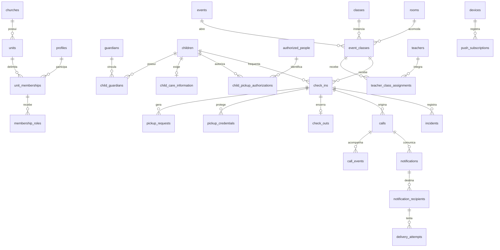

# Modelo inicial de dados

Este é um modelo lógico revisável, não uma migration executável. PostgreSQL será a fonte de verdade. RLS e grants complementarão as restrições relacionais.

## Convenções

- PK `id uuid`; datas em `timestamptz`, produzidas pelo servidor, armazenadas com referência UTC e exibidas no fuso IANA da unidade.
- Entidades pertencentes à unidade têm `unit_id`. Relações usam FKs compostas `(unit_id, id)` onde necessário para impedir vínculos entre unidades.
- Cadastros mutáveis: `created_at`, `updated_at`, `created_by`, `updated_by`, `status` e `deleted_at/deleted_by` quando cabível.
- Eventos imutáveis: `created_at`, ator, unidade, tipo e metadados permitidos; não simular `updated_at` onde não há atualização.
- `created_by` identifica autor, não necessariamente responsável operacional. Responsável, professora, solicitante e validadora têm campos próprios.
- Exclusão lógica não substitui retenção ou anonimização. FKs históricas usam restrição de exclusão; evitar cascata que apague operações.
- Motivos, status e permissões têm vocabulário controlado. Texto livre possui limites e validação.

## Diagrama principal

O diagrama mostra as relações centrais. A tabela abaixo também especifica entidades auxiliares de segurança, processamento e auditoria.

## Dicionário resumido

| Entidade | Campos específicos e função |
| --- | --- |
| `churches` | nome, status; agrupamento institucional sem conceder acesso automático às unidades |
| `units` | church_id, nome, slug público, timezone, status |
| `unit_settings` | unit_id único, versão das regras, prazos de escalonamento, capacidade/recebimento conforme decisão operacional |
| `profiles` | id vinculado a `auth.users.id`, nome de exibição, status; senha fica exclusivamente no Auth |
| `unit_memberships` | unit_id, user_id, status, início/fim; vínculo único por usuário/unidade |
| `roles` | código: guardian, teacher, administrator; catálogo controlado |
| `membership_roles` | membership_id, role_id, concedido_por, concedido_em, revogado_em |
| `guardians` | unit_id, user_id, nome, telefone, e-mail de contato, estado de verificação; contato de cadastro não altera automaticamente identidade Auth |
| `children` | unit_id, nome, data_nascimento, status; sem CPF/foto por padrão |
| `child_guardians` | child_id, guardian_id, parentesco, pode_gerenciar, pode_checkin, pode_retirar, status, valid_from/to; permissões não inferidas de parentesco |
| `guardian_invitations` | vínculo pretendido, destinatário protegido, hash do token, expiração, aceite/revogação; sem vincular por simples busca nominal |
| `child_care_information` | child_id único, alergias, medicamentos informados, necessidades, observações, updated_by; informar medicamento não autoriza administração |
| `authorized_people` | unit_id, nome e contato mínimo; opcional guardian_id da própria unidade, sem exigir conta Auth |
| `child_pickup_authorizations` | child_id, person_id, granted_by, validade, status/revogação; autorização atual deve ser verificada na retirada |
| `teachers` | unit_id, user_id, status; vínculo único por usuário/unidade |
| `rooms` | unit_id, nome, capacidade física, status |
| `classes` | unit_id, nome, min_age_months, max_age_months_exclusive, status |
| `events` | unit_id, título, início/fim, janela de check-in, status: draft/open/closed/cancelled |
| `event_classes` | event_id, class_id, room_id, capacidade, status, faixa etária congelada; identifica turma naquele evento |
| `teacher_class_assignments` | teacher_id, event_class_id, permissões operacionais, validade/revogação; templates recorrentes poderão gerar vínculos explícitos |
| `check_ins` | child_id, guardian_id, contact_guardian_id, event_id, event_class_id, requested_at, received_at/by, status, public_code, regras/idade no evento, idempotency_key; ator em created_by |
| `pickup_requests` | check_in_id, requested_by, requested_at, status, cancelled_at; pedido não conclui saída |
| `pickup_credentials` | check_in_id, tipo qr/numeric, token_digest protegido, signing_key_version, expires_at, consumed_at, revoked_at, failed_attempts; nunca armazenar token bruto |
| `check_outs` | check_in_id único, pickup_request_id opcional, requested_by, pickup_authorization_id, pickup_person_id, validated_by, completed_by, completed_at, credential_id ou referência de exceção, método e justificativa codificada |
| `call_reasons` | unit_id, código, rótulo, ordem, status; motivos configuráveis sem apagar referências históricas |
| `calls` | check_in_id, incident_id opcional, reason_id, note restrita, created_by, occurrence_key, status, viewed_at, acknowledged_at/by, on_the_way_at/by, closed_at/by |
| `call_events` | call_id, tipo, actor_id, timestamp; trilha imutável das transições, sem repetir observação sensível |
| `incidents` | check_in_id, categoria, descrição restrita, recorded_by, occurred_at, visibility, status |
| `incident_revisions` | incident_id, versão, texto restrito, autor, data e motivo; histórico restrito de correções, separado da auditoria geral |
| `notifications` | call_id, template_key, versão, created_by; significado da comunicação sem copiar texto médico |
| `notification_recipients` | notification_id, guardian_id, disponibilizada_em, viewed_at, acknowledged_at; controle por destinatário |
| `notification_preferences` | guardian_id, canal, habilitado, updated_at; distinguir comunicação operacional de mensagens opcionais |
| `devices` | user_id, identificador aleatório da instalação, descrição mínima, last_seen_at, revoked_at; sem fingerprint invasivo |
| `push_subscriptions` | device_id, endpoint e chaves protegidos, status, created_at, invalidated_at; tratar endpoint como segredo de capacidade |
| `delivery_attempts` | recipient_id, canal, subscription_id opcional, attempt_number, status, scheduled_at, started_at, accepted_at, delivered_at, failed_at, provider_message_id, error_code saneado, idempotency_key |
| `outbox_events` | unit_id, aggregate_type/id, event_type, versão, payload mínimo, created_at, processed_at; gravação junto ao evento de domínio |
| `scheduled_jobs` | outbox_id, tipo/canal/destinatário, run_after, status, lease_until, worker_id, attempts, dedupe_key, last_error_code |
| `legal_document_versions` | tipo, versão, texto ou referência pública imutável, published_at, effective_at |
| `consents` | guardian_id, child_id quando aplicável, documento/finalidade, versão, granted_at, withdrawn_at, forma de manifestação; não sobrescrever histórico |
| `privacy_requests` | requester_id, tipo, status, created_at, resolved_at, handled_by, fundamento/resposta restritos |
| `integration_settings` | unit_id, provider, enabled=false, mode, duration_seconds, configuração não secreta, secret_reference opcional |
| `integration_logs` | integração, evento de domínio, código público, status, attempt_number, command_sent_at, connection_observed_at/status, error_code, correlation_id; sem credenciais |
| `audit_logs` | unit_id, actor_id ou worker, action, entity_type/id, occurred_at, correlation_id, campos alterados permitidos e resultado; sem cópia de dados médicos |
| `idempotency_records` | ator/unidade/operação/chave, hash do pedido, resource_id, resultado seguro, validade; não guardar comprovante secreto em resposta persistida |
| `server_sessions` | identificador opaco protegido, user_id, tokens protegidos, expiração, revogação; schema exclusivo do servidor, nunca exposto por API pública |

## Invariantes e restrições planejadas

1. Índice único parcial em `check_ins(unit_id, event_id, child_id)` para estados `pending_reception`, `present`, `pickup_requested`. Uma solicitação pendente também reserva a vaga e impede duplicata.
2. `check_outs(check_in_id)` único. Transação bloqueia a presença antes de consumir a credencial e gravar a saída.
3. `public_code` único globalmente no registro de códigos históricos, nunca reassociado a outro evento. Gerar parte aleatória com espaço suficiente, prefixo legível e controle de colisão; não usar um contador que reinicie a cada culto.
4. Credenciais QR e numérica expiram no check-out. Consumir uma revoga todas as alternativas da mesma presença. Validar expiração no servidor.
5. Deduplicação de chamado ativo por `(unit_id, check_in_id, occurrence_key)`; motivos diferentes não são prova de ocorrências diferentes. Mesmo incidente usa a mesma chave. Sem incidente, a proposta inicial reutiliza o chamado ativo geral, com exceção explícita a definir.
6. Unicidade de dedupe_key em tarefas e de combinação destinatário/canal/dispositivo/número da tentativa. Mensagens do provedor podem ser duplicadas; idempotência local não elimina incerteza externa.
7. `max_age_months_exclusive > min_age_months >= 0`; idade calculada na data local do evento. Sobreposição de faixas é validada na configuração e resolvida sem decisão arbitrária no check-in.
8. Capacidade exige bloqueio transacional da turma e contagem de vagas reservadas/presentes, ou contador protegido equivalente. Um simples CHECK não resolve concorrência entre linhas.
9. Horários de conclusão não precedem entrada; não permitir checkout de solicitação ainda não recebida. Cancelamento de solicitação é uma operação distinta.
10. Mudanças de unidade e reatribuição de autoria são proibidas em registros históricos. Desativação impede novas operações, preservando referências anteriores.
11. Check-in referencia responsável e criança vinculados na mesma unidade. Pessoa de retirada deve ter autorização vigente para a criança ou permissão de responsável equivalente explicitamente representada.
12. Datas/faixas e referências históricas mínimas preservam a interpretação do evento. Evitar snapshots desnecessários de informação médica ou documentos pessoais.

## Índices e consulta

Planejar índices em FKs e filtros RLS: `(unit_id, user_id)`, vínculos por responsável/criança, atribuições por professora/turma, presenças por `(unit_id, event_id, status)`, chamados por presença/status, eventos por início e auditoria por unidade/data. Tarefas terão índice em `(status, run_after)` e controle de lease. Busca nominal será escopada à turma antes de qualquer busca ampla.

Relatórios usarão views/funções que preservem autorização; não publicar views com privilégios elevados que ignorem RLS. Verificar planos de consulta com volume fictício representativo na Fase 3/4.

## Pontos para a migration futura

Definir enums versus tabelas de domínio, tamanho dos códigos, TTLs, armazenamento protegido de contatos/subscriptions e política de sessões. Migrations serão versionadas e testadas em banco descartável; este documento não autoriza aplicar mudanças em produção.
